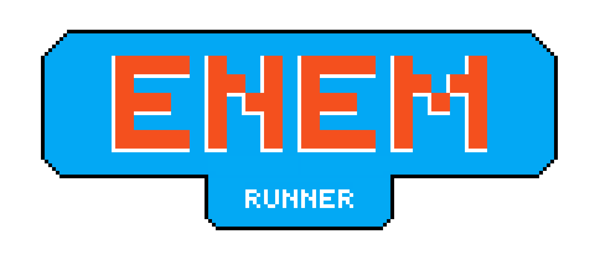

 

 

 

 

<b>Desenvolvedores:</b> Arthur Cordeiro Ferreira Souza, Éric Catarina Parreiras, Gabriel Benvindo Begnami e Gabriel Machado Violante;

- Características Gerais: Pixelado, Runner, 2D;

- Plataforma: Mobile e Desktop;

- Prerrogativa: Retratar os problemas de locomoção de pessoas com deficiência no meio urbano atual;

- Objetivo: Conscientizar os usuários acerca da necessidade da melhora dos nossos espaços públicos, a fim de torná-los mais acessíveis a todas as pessoas, assim como, o jogo tem como intuito agregar mais possibilidades de imersão;

## Ideia Do Jogo

Em Enem Runner você poderá escolher três personagens: Enzo, Valentina e Iraci, todos com algum tipo de deficiência. Eles irão confrontar o cenário caótico das ruas brasileiras, que possuem vários empecilhos em sua acessibilidade.

 

   
  
  
 

  Iraci

  OBS: OUTRAS PIXEL ARTS ESTÃO EM CONSTRUÇÃO (CENAS DOS PRÓXIMOS CAPÍTULOS)

## Mecânica Do Jogo

Enem Runner será feito sob um importante conceito, o de Blind Runner: game design de uma corrida infinita acessível à
cultura com deficiência visual. A mecânica do jogo consistirá na capacidade de Iraci, um dos personagens apresentados, em se orientar através dos sons. Quando um obstáculo como por exemplo: uma árvore ou um carro vier em sua direção, ele será capaz de ouvir o objeto se aproximando, e consequentemente se desviar. Tais obstáculos virão de forma aleatória e gradativa, dessa forma, o jogo ficará mais rápido e mais difícil ao passar do tempo. 

   
  

## Telas Do Jogo

### Menu Principal (Layout Inteligente)

A ideia do ENEM RUNNER é ser COMPLETAMENTE acessível para deficientes visuais. Nesse sentido, suas telas apresentam poucos botões, sendo que os inseridos estão dispostos em locais estratégicos, isto é, apenas nas extremidades da tela ou em sua parte central, que são facilmente identificadas através do toque e por dicas auditivas.

   
  

### Elementos adicionais de acessibilidade

#### Botão Universal de Tutorial

Além do LAYOUT ACESSIVO, o ENEM RUNNER irá contar com dicas, orientações e representações sonoras ao usuário, tanto durante, quanto fora da ação do game. Sob essa ótica, haverá um botão universal, isto é, presente em todas as telas no canto superior direito, que ao ser clicado informará oralmente todas as instruções da cena que o usuário está inserido.

  

___

#### Botão de Configurações 

O botão de configurações, presente no canto superior esquerdo da tela tem o intuito de apresentar as opções de configurações ao usuário, como opções de áudio e imagem.

  

___

#### Tela de PLAY

  

  Essa tela, seguindo nossa proposta acessível, apresenta em seu canto superior direito o botão universal, que apresentamos anteriormente, responsável em auxiliar oralmente o usuário. No superior esquerdo há a opção de configurações que ao ser clicada levará a uma tela com as características editáveis do jogo, tal cena será melhor descrita no próximo tópico. Quando o usuário clicar em qualquer parte central da tela, o jogo iniciará. Há também a parte inferior, com os ícones de seta, um a esquerda e outro a direita, responsáveis por caminhar entre a lista de personagens[3] = { "Enzo" , "Valentina" , "Iraci" }.

___

#### Tela das Configurações

  

 A tela de configurações também segue o layout acessível desenvolvido pelo grupo. Então, como mostrado na imagem, cada cena das configurações contém apenas uma configuração a ser alterada, para que o usuário a utilize tranquilamente, no canto inferior da tela há os ícones de seta, um a esquerda e outro a direita que serão responsáveis por circular entre as opções de configurações atribuídas ao jogo, e cada uma delas ocupará uma página. Posteriormente, adicionaremos outras páginas de opções, como linguagem, áudio e cores. 
 
Além disso, como dito anteriormente, o canto superior direito contém o botão universal que dará as dicas da página de configuração ativa pelo jogador e no canto superior esqquerdo o botão para retornar a página de menu principal. E, baseando-se no exemplo mostrado acima, na parte central a esquerda o usuário diminui o volume e a direita aumenta o volume, ambos emitirão sons ao serem clicados.

___

#### Tela do Jogo

 

 

Esse é um esboço da tela principal do jogo, nessa parte o usuário conseguirá deslizar os dedos para a direita ou esquerda a fim de desviar dos obstáculos, que nesse exemplo, são apenas as árvores, mas haverá carros, buracos, ladrões, entre outros. Além disso, a tela será diferente para cada personagem, isto é, existirão diferentes níveis de imersão. Haverá a tela completamente escura, orientada apenas pelo som, a tela mostrada acima, que possuirá os sons e as imagens, e a tela com um campo de visão reduizo para a personagem, ou seja, o usuário irá escutar o obstáculo e a direção pela qual ele está vindo e irá aparecer na tela apenas quando estiver muito perto de colidir com ele.
 
Posteriormente, ao colidir com algum obstáculo, um som e uma mensagem será emitida orientando que aquela rodada acabou e que para continuar basta clicar em qualquer lugar da tela. Ademais, haverá um butão de fácil acesso para pausar a gameplay, o que é extremamente necessário. Lembrando que, como foi dito anteriormente, todas as orientações das diferentes telas do jogo estarão disponíveis em formato de áudio.

___

